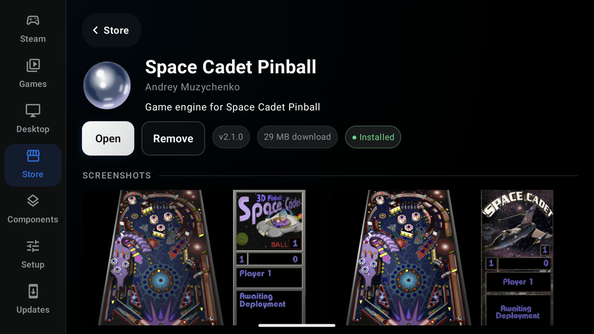
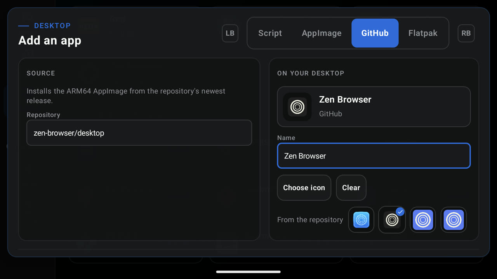
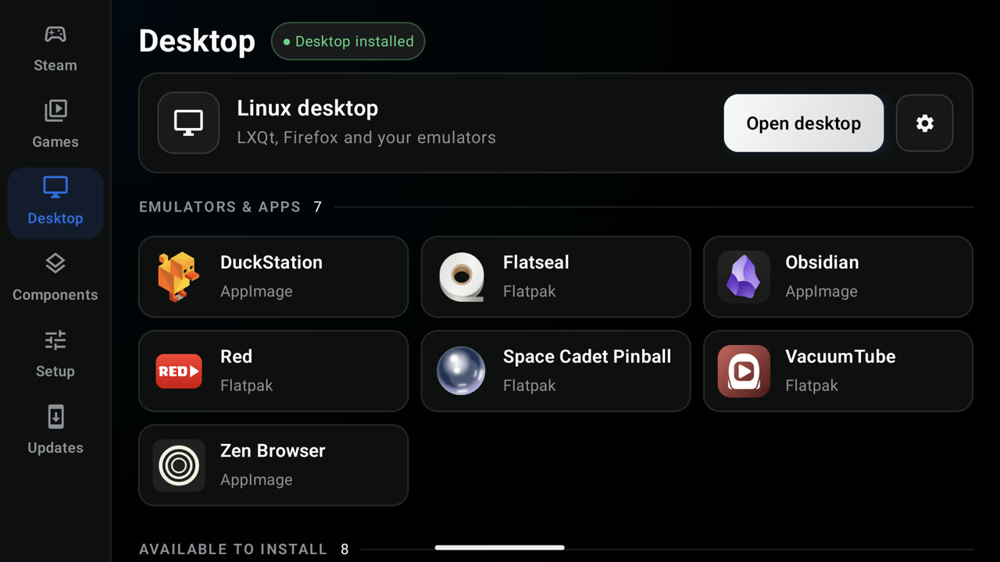
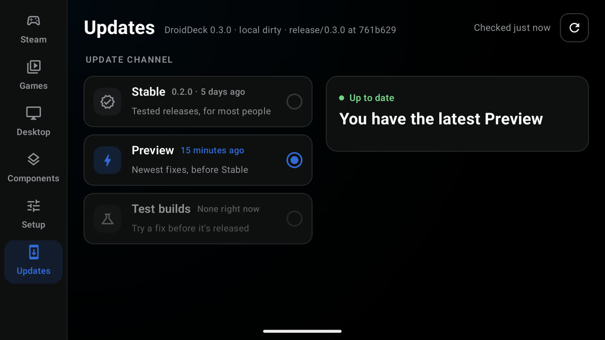
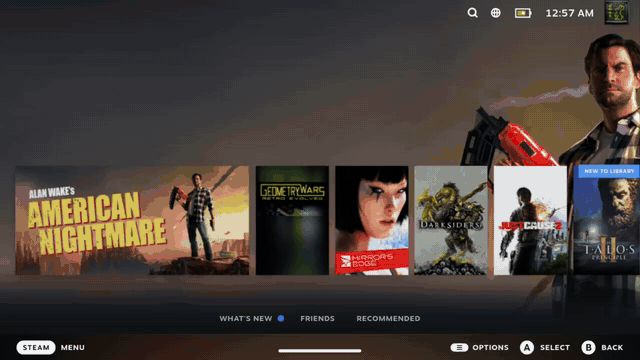

# DroidDeck 0.3.0 (beta)

## Highlights

### Steam, as on a Steam Deck
Deck mode is now the default. Steam's performance overlay goes from level 1 to 4 in Quick Access and shows GPU and CPU load, clocks, temperatures, VRAM and battery, even on phones that lock those files away. Games keep running behind the Quick Access Menu and the Steam menu, and Quick Access shows battery life and time to full.

### A Steam Deck controller
In Steam sessions the client reads your pad as a Steam Deck controller, with a real Quick Access button and your handheld's gyro. Games get Steam Input's virtual pads, so your Steam Input layouts reach them. On a dual-screen handheld, the second screen can be the Deck's back grips and trackpads.

### Faster to Steam, faster in games
Steam's own startup is down from about 31 seconds to about 6, and that makes **Offline mode** work. proot has been optimized for calls games make most, and there's a new per-mode frame limiter.

### GPU drivers that set themselves
A new **GPU drivers** tab detects your GPU and keeps a matched pair of runtime and display drivers installed for it, including DroidDeck's own DD-Turnip builds. Switch to **Manual** to pick a pair yourself.

### Linux apps from Flathub, bring your own Appimage, and more
Turn on the **Flathub Store** in Setup to install ARM64 apps and games from Flathub. They open full screen from the front end with your controller. The Desktop page also takes your own apps: a script, an AppImage, a GitHub repo's newest ARM64 AppImage, or a Flatpak ID.

### Updates in the app
The **Updates** page installs new builds without leaving DroidDeck: **Stable**, **Preview** (each build of main) or a **Test build** of an open pull request. Every download is checked against its checksum and DroidDeck's release key before Android sees it.

### A front end that moves as one
One focus ring slides between controls, settings flood out of the cog the way Play floods into a session, and Stop asks before it ends anything. DroidDeck is now available in Spanish, with more languages coming soon (contributions welcome).

---

## Everything in 0.3.0

### Steam

- Steam's startup down from about 31 s to about 6 s, so Offline mode works (@xXJSONDeruloXx, #69)
- Deck mode on for everyone, moved once on update, always on the Steam Deck client branch so Steam stops offering a downgrade (@xXJSONDeruloXx, #100, #101, #141)
- Steam's performance overlay (MangoHud), levels 1–4, with Adreno GPU, CPU, VRAM and temperature stats, and a switch to turn it off (@xXJSONDeruloXx, #55, #101)
- The overlay keeps running and filled in under an enforcing SELinux policy, as on retail phones (@xXJSONDeruloXx, #127)
- Games keep running behind the Quick Access Menu and the Steam menu (@xXJSONDeruloXx, #131)
- A game that minimized itself behind the Steam menu comes back on Resume (@The412Banner, #89)
- Quick Access shows battery life and time to full (@xXJSONDeruloXx, #117)
- Steam shuts down cleanly when you stop a session, so it keeps its caches (@xXJSONDeruloXx, #68)
- Games you own in a second library or games folder become real Steam games instead of shortcuts (@maxjivi05, #62)
- Imported games keep their installed build, so Steam doesn't re-verify them (@maxjivi05, #108)
- Launch options on added games are kept between sessions (@xXJSONDeruloXx, #111)
- Choose the host name Steam sees (@magarto, #61)
- Stretch 16:9 games onto screens narrower than 16:9, such as foldables (opt-in) (@magarto, #63)

### Controls

- Steam Deck controller for the Steam client: a real Quick Access button, the handheld's gyro, and Steam Input's virtual pads for games (@xXJSONDeruloXx, #86)
- Deck back grips and trackpads on the second screen (@xXJSONDeruloXx, #86)
- Xbox 360 controller option, with the right axis layout for games that have Steam Input off (@xXJSONDeruloXx, #86, #102)
- The Steam client finds the Deck controller under an enforcing SELinux policy (@xXJSONDeruloXx, #125)
- Touch scrolls Steam on phones with no controller at start (@xXJSONDeruloXx, #123)
- Quick Access from Back comes sooner, and no longer opens the focused game under load (@xXJSONDeruloXx, #70, #73)
- Shift and Caps Lock type capitals (@xXJSONDeruloXx, #71)
- Adaptive sticks hide when idle and appear where you touch (@maxjivi05, #53)

### Display and performance

- GPU drivers tab: Auto keeps a matched runtime and display pair for your GPU, Manual lets you pick one (@xXJSONDeruloXx, #103)
- DD-Turnip, DroidDeck's own driver bundles (@maxjivi05, #106)
- Adreno 840v2 (retail SM8850) works with the runtime's own driver (@xXJSONDeruloXx, #93)
- Setup says when a GPU is untested (Adreno 6xx, 710, 720, 722) (@xXJSONDeruloXx, #103)
- LSFG takes Lossless Scaling from your Steam library by itself, adds 60, 90 and 120 fps targets, and paces generation to the game's frames (@maxjivi05, #96, #129)
- Per-mode frame limiter, live panel refresh, opt-in GPU clock pin and Mesa's database shader cache (@maxjivi05, #87)
- proot stops less often: kompat, fake_id0 and ioctl traps trimmed, and common path lookups answered in-process (@xXJSONDeruloXx, @maxjivi05, #81, #84, #113)
- Turnip's GPU timestamp polls answered without blocking (@maxjivi05, #87)
- Cheaper defaults: Steam's xalia helper skipped, gamescope's realtime queue off, microphone off (@xXJSONDeruloXx, #85)
- Per-game environment variables, now in an editor that works with a pad (@maxjivi05, @xXJSONDeruloXx, #60, #140)

### Apps and desktop

- Flathub Store: ARM64 Flatpak apps and games, opened full screen from the front end and listed on the Desktop page (@xXJSONDeruloXx, #77)
- Add your own apps to the Desktop page: a script, an AppImage, a GitHub repo or a Flatpak ID, with icons and update checks (@maxjivi05, #130)
- The desktop hands its cursor to the app, so full-screen games skip a compositing pass (@xXJSONDeruloXx, #57)

### Launcher

- Updates page: Stable, Preview and Test builds, installed in the app and verified first (@xXJSONDeruloXx, #98, #112, #115)
- Game saves: import and export GameHub and Winlator save zips for added games (@The412Banner, #91)
- One focus ring slides between controls, settings flood out of the cog, and focus returns to what opened a page (@xXJSONDeruloXx, #105, #140)
- Stop asks first, and quitting floods back into the launch button (@xXJSONDeruloXx, #72, #105)
- Spanish, with every screen's text moved to translatable strings (@xXJSONDeruloXx, #140)
- Pair wireless debugging from a notification to lift Android's child-process limit (@xXJSONDeruloXx, #67)

### Sessions and logs

- Session folders are named by day, number and mode, the newest 30 are kept, and Setup has **Clear logs** (@xXJSONDeruloXx, #122)
- Shared logs carry controller and touch-mode details for input reports (@xXJSONDeruloXx, #125)

### Fixed

- Steam sessions failing to start with the app on adopted SD storage (@xXJSONDeruloXx, #119)
- Second-library games failing to launch or install their dependencies (@xXJSONDeruloXx, #134)
- Steam's own installs on a second library showing up as non-Steam shortcuts (@xXJSONDeruloXx, #138)
- A white veil left after closing the session menu (@xXJSONDeruloXx, #135)
- Update channel cards flashing as a controller moved over them (@xXJSONDeruloXx, #99)
- Flatpak installs failing (@maxjivi05, #82)
- gamescope respawning a crashing overlay every second (@xXJSONDeruloXx, #81)

