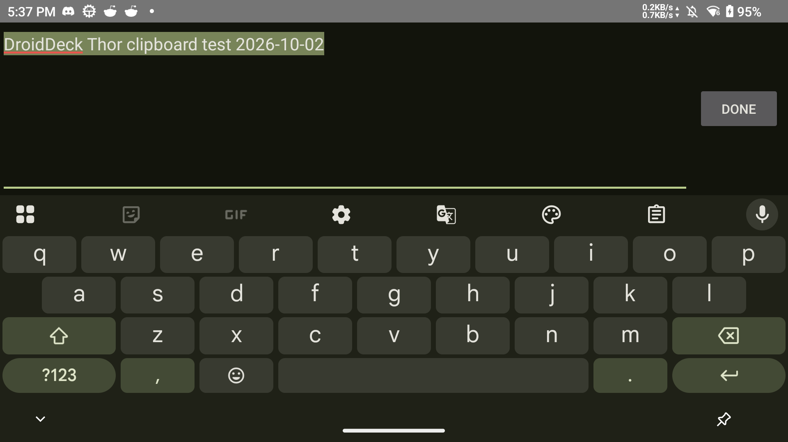

# Android clipboard text

Copy text in an Android app, return to DroidDeck, and paste into Steam with Ctrl+V.
The session's PC keyboard supports this through its sticky Ctrl key and V.

Android clipboard reads follow window focus, including the secondary-display presentation.
The existing Wayland text selection handles native guest clients. Gamescope does not relay
that selection to its inner Xwayland, so a session helper publishes Android text there.
It waits for file and X11 events, and exits when its parent session exits.

The Gamescope bridge currently supports Android-to-guest plain text up to 64 KiB.
It does not transfer images/files or export Steam's copied text back to Android.
Oversized text clears an earlier Android selection rather than pasting a truncated command.
Clipboard text stays in private app data and is never included in session logs.

## Thor validation, 2026-10-02

AYN Thor, serial `d234a848`, Android 13, release APK installed in place.
Built with `tools/build_local.sh`; shell syntax, workflow YAML, and diff checks passed.
Installed APK SHA-256 matched the local artifact:
`624782af4319af538a9ae5dba6e012ebb51c7fd43a3955c4f568d214f9c32c07`.

- The supplied launch-options string pasted through Ctrl+V into Steam's actual Launch Options field exactly. The field was restored to its original empty value.
- Unicode (`café 日本語 😀`, quotes, dollar sign, and backslash) also pasted exactly into Steam. The field was restored again.
- Final-build X11 selection checks passed for launch options, multiline text, Unicode, 8 KiB, clearing, and replacing the clipboard across Android app switches.
- Copying on Thor's second display transferred the text while Steam remained visible on the first display.
- Copying the same Android text after a guest owned the X11 selection restored the Android selection.
- A 65,537-byte clipboard was rejected without truncation; a subsequent normal clipboard transferred correctly.
- The helper exited during APK replacement. The temporary Android test app, guest probe, and local ADB forward were removed.

Local screenshots, field values, build log, and check results: `/tmp/droiddeck-clipboard-evidence`.

## Visible editor-to-Steam test

Typed the supplied launch command into a temporary native Android EditText editor
using Android keyboard events, selected all, and copied with Android's standard
Ctrl+C action. Returned to the running DroidDeck Steam session and pasted into
The Sims Legacy Collection's Launch Options. Steam's persisted value matched the
complete 126-byte command exactly. No clipboard-setting API was used by the editor.

Repeated with `DroidDeck Thor clipboard test 2026-10-02`, using Steam's on-screen
keyboard Paste button. The whole value is visible in these unedited Thor screenshots:

The launch options were restored to their original empty value and verified in
Steam's configuration. The temporary editor and ADB forward were removed.
