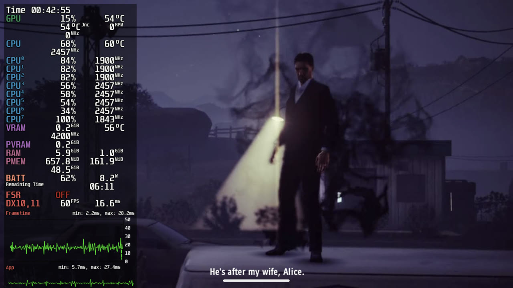
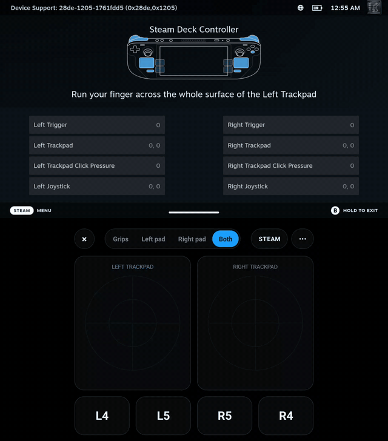
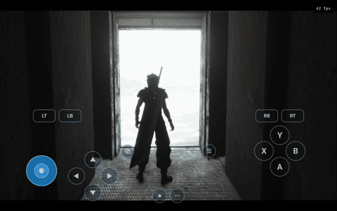
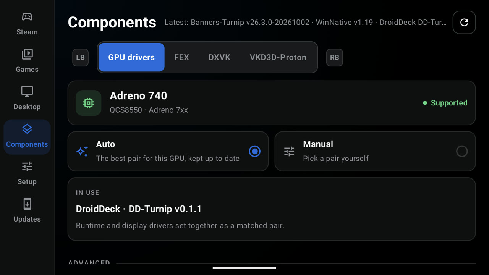
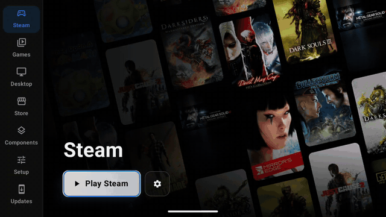

# DroidDeck 0.3.0（beta）

## 亮点

### Steam，如在 Steam Deck 上
Deck 模式现在默认开启。Quick Access 中的 Steam 性能叠加层可从 1 级调到 4 级，显示 GPU 与 CPU 负载、频率、温度、显存和电量——即使在锁死这些文件的手机上也一样。游戏在 Quick Access 菜单和 Steam 菜单后面保持运行，Quick Access 还会显示剩余电量和充满所需时间。

### Steam Deck 手柄
在 Steam 会话中，客户端会把你的手柄识别为 Steam Deck 手柄，带真实的 Quick Access 按键和掌机的陀螺仪。游戏获得 Steam Input 的虚拟手柄，你的 Steam Input 布局因此对游戏生效。在双屏掌机上，副屏可以充当 Deck 的背键与触控板。

### 更快进入 Steam，游戏中更流畅
Steam 自身启动时间从约 31 秒降到约 6 秒，这也让**离线模式**得以可用。proot 针对游戏最常发起的调用做了优化，并新增了按模式的帧率限制器。

### 自我配置的 GPU 驱动
新的 **GPU 驱动**标签页会检测你的 GPU，并为它保持一对匹配的运行时与显示驱动（含 DroidDeck 自己的 DD-Turnip 构建）。切到**手动**可自行挑选配对。

### 来自 Flathub 的 Linux 应用、自带 AppImage，以及更多
在设置中打开 **Flathub 商店**，即可从 Flathub 安装 ARM64 应用与游戏。它们会用手柄从前端全屏打开。桌面页也接受你自己的应用：脚本、AppImage、GitHub 仓库的最新 ARM64 AppImage，或 Flatpak ID。

### 应用内更新
**更新**页面无需离开 DroidDeck 即可安装新构建：**稳定版**、**预览版**（main 的每次构建）或开放拉取请求的**测试构建**。每个下载在 Android 收到它之前都会核对校验和与 DroidDeck 的发布密钥。

### 一个整体联动的前端
一个焦点环在控件之间滑动，设置从齿轮中涌出（如同“游玩”涌入会话），停止按钮会在结束任何内容前先询问。DroidDeck 现已提供西班牙语，更多语言即将到来（欢迎贡献）。

---

## 0.3.0 全部内容

### Steam

- Steam 启动时间从约 31 秒降到约 6 秒，离线模式因此可用（@xXJSONDeruloXx，#69）
- 所有人默认开启 Deck 模式，更新时迁移一次；始终运行 Steam Deck 客户端分支，Steam 不再提供降级版本（@xXJSONDeruloXx，#100、#101、#141）
- Steam 性能叠加层（MangoHud），1–4 级，带 Adreno GPU、CPU、显存与温度统计，以及关闭开关（@xXJSONDeruloXx，#55、#101）
- 在强制 SELinux 策略下叠加层照常运行并正常显示，与零售手机一致（@xXJSONDeruloXx，#127）
- 游戏在 Quick Access 菜单和 Steam 菜单后面保持运行（@xXJSONDeruloXx，#131）
- 在 Steam 菜单后自行最小化的游戏在恢复时回到前台（@The412Banner，#89）
- Quick Access 显示剩余电量和充满时间（@xXJSONDeruloXx，#117）
- 停止会话时 Steam 干净关停，缓存得以保留（@xXJSONDeruloXx，#68）
- 第二库或游戏文件夹中拥有的游戏成为真正的 Steam 游戏而非快捷方式（@maxjivi05，#62）
- 导入的游戏保留其已安装构建，Steam 不会重新校验（@maxjivi05，#108）
- 添加游戏的启动选项在会话之间保留（@xXJSONDeruloXx，#111）
- 可选择 Steam 看到的主机名（@magarto，#61）
- 把 16:9 游戏拉伸到窄于 16:9 的屏幕（如折叠屏，需选择启用）（@magarto，#63）

### 控制

- 面向 Steam 客户端的 Steam Deck 手柄：真实 Quick Access 按键、掌机陀螺仪，以及供游戏使用的 Steam Input 虚拟手柄（@xXJSONDeruloXx，#86）
- 副屏上的 Deck 背键与触控板（@xXJSONDeruloXx，#86）
- Xbox 360 手柄选项，为关闭 Steam Input 的游戏提供正确的轴布局（@xXJSONDeruloXx，#86、#102）
- 在强制 SELinux 策略下 Steam 客户端也能找到 Deck 手柄（@xXJSONDeruloXx，#125）
- 启动时没有手柄的手机上，触摸可滚动 Steam（@xXJSONDeruloXx，#123）
- Back 键进入 Quick Access 更快，且负载下不再打开当前聚焦的游戏（@xXJSONDeruloXx，#70、#73）
- Shift 与 Caps Lock 可输入大写字母（@xXJSONDeruloXx，#71）
- 自适应摇杆闲置时隐藏，触摸处出现（@maxjivi05，#53）

### 显示与性能

- GPU 驱动标签页：自动为你的 GPU 保持匹配的运行时与显示配对，手动可自行挑选（@xXJSONDeruloXx，#103）
- DD-Turnip，DroidDeck 自己的驱动包（@maxjivi05，#106）
- Adreno 840v2（零售版 SM8850）配合运行时自带驱动可用（@xXJSONDeruloXx，#93）
- 设置页会标明 GPU 未经测试（Adreno 6xx、710、720、722）（@xXJSONDeruloXx，#103）
- LSFG 自动从你的 Steam 库获取 Lossless Scaling，新增 60、90、120 fps 目标，并按游戏帧节奏生成（@maxjivi05，#96、#129）
- 按模式的帧率限制器、实时面板刷新、可选的 GPU 时钟锁定，以及 Mesa 数据库着色器缓存（@maxjivi05，#87）
- proot 停顿更少：裁剪 kompat、fake_id0 与 ioctl 陷阱，常见路径查询在进程内完成（@xXJSONDeruloXx、@maxjivi05，#81、#84、#113）
- Turnip 的 GPU 时间戳轮询不再阻塞（@maxjivi05，#87）
- 更省的默认值：跳过 Steam 的 xalia 助手、关闭 gamescope 实时队列、关闭麦克风（@xXJSONDeruloXx，#85）
- 按游戏的环境变量，现有可用手柄操作的编辑器（@maxjivi05、@xXJSONDeruloXx，#60、#140）

### 应用与桌面

- Flathub 商店：ARM64 Flatpak 应用与游戏，从前端全屏打开并列在桌面页（@xXJSONDeruloXx，#77）
- 向桌面页添加你自己的应用：脚本、AppImage、GitHub 仓库或 Flatpak ID，带图标与更新检查（@maxjivi05，#130）
- 桌面把光标交给应用，全屏游戏因此省掉一次合成（@xXJSONDeruloXx，#57）

### 启动器

- 更新页：稳定版、预览版与测试构建，应用内安装并先行校验（@xXJSONDeruloXx，#98、#112、#115）
- 游戏存档：为添加的游戏导入/导出 GameHub 与 Winlator 的存档 zip（@The412Banner，#91）
- 一个焦点环在控件间滑动、设置从齿轮涌出、焦点回到打开页面的来源（@xXJSONDeruloXx，#105、#140）
- 停止先询问，退出时涌回启动按钮（@xXJSONDeruloXx，#72、#105）
- 西班牙语，且每个界面的文案都迁移到可翻译的字符串资源（@xXJSONDeruloXx，#140）
- 从通知配对无线调试以解除 Android 的子进程限制（@xXJSONDeruloXx，#67）

### 会话与日志

- 会话文件夹按日期、序号与模式命名，保留最新 30 个，设置页提供**清除日志**（@xXJSONDeruloXx，#122）
- 共享日志附带手柄与触控模式详情，便于输入问题报告（@xXJSONDeruloXx，#125）

### 修复

- 应用位于采用的 SD 存储上时 Steam 会话无法启动（@xXJSONDeruloXx，#119）
- 第二库游戏无法启动或安装其依赖（@xXJSONDeruloXx，#134）
- 第二库上 Steam 自己的安装显示为非 Steam 快捷方式（@xXJSONDeruloXx，#138）
- 关闭会话菜单后残留白色遮罩（@xXJSONDeruloXx，#135）
- 手柄划过时更新通道卡片闪烁（@xXJSONDeruloXx，#99）
- Flatpak 安装失败（@maxjivi05，#82）
- gamescope 每秒重新拉起一个崩溃的叠加层（@xXJSONDeruloXx，#81）
