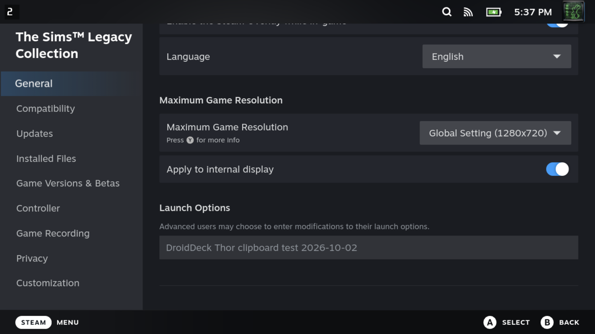

# Android 剪贴板文本

在 Android 应用中复制文本，回到 DroidDeck，用 Ctrl+V 粘贴进 Steam。
会话的 PC 键盘通过粘滞 Ctrl 键与 V 键支持这一操作。

Android 剪贴板读取跟随窗口焦点，包括副屏呈现。
既有的 Wayland 文本选择处理原生 guest 客户端。gamescope 不会把该选择中继给其内部的
Xwayland，因此会话辅助进程在那里发布 Android 文本。它等待文件与 X11 事件，并在所属会话
退出时随之退出。

Gamescope 桥目前支持 Android 到 guest 的纯文本，上限 64 KiB。
它不传输图片/文件，也不把 Steam 中复制的文本导出回 Android。
超长文本会清除先前的 Android 选择，而不是粘贴被截断的命令。
剪贴板文本保存在应用私有数据中，绝不会进入会话日志。

## Thor 验证，2026-10-02

AYN Thor，序列号 `d234a848`，Android 13，就地安装发布版 APK。
使用 `tools/build_local.sh` 构建；shell 语法、工作流 YAML 与 diff 检查全部通过。
已安装 APK 的 SHA-256 与本地产物一致：
`624782af4319af538a9ae5dba6e012ebb51c7fd43a3955c4f568d214f9c32c07`。

- 提供的启动选项字符串经 Ctrl+V 精确粘贴进 Steam 真正的启动选项字段。粘贴后该字段恢复为原来的空值。
- Unicode（`café 日本語 😀`、引号、美元符与反斜杠）同样精确粘贴进 Steam，字段再次被还原。
- 最终构建的 X11 选择检查通过：启动选项、多行文本、Unicode、8 KiB、清除，以及跨 Android 应用切换时替换剪贴板。
- 在 Thor 副屏上复制时，第一屏 Steam 保持可见的情况下文本成功传输。
- 在 guest 拥有 X11 选择之后复制同一段 Android 文本，恢复了 Android 选择。
- 一个 65,537 字节的剪贴板被拒绝且未截断；随后的普通剪贴板正确传输。
- APK 替换期间辅助进程自行退出。临时 Android 测试应用、guest 探针与本地 ADB 转发均已移除。

本机截图、字段值、构建日志与检查结果：`/tmp/droiddeck-clipboard-evidence`。

## 可见的编辑器到 Steam 测试

用 Android 键盘事件把给定的启动命令键入一个临时的原生 Android EditText 编辑器，
全选后用 Android 标准的 Ctrl+C 动作复制。返回正在运行的 DroidDeck Steam 会话，粘贴进
《The Sims Legacy Collection》的启动选项。Steam 持久化的值与完整的 126 字节命令完全一致。
编辑器未使用任何设置剪贴板的 API。

用 `DroidDeck Thor clipboard test 2026-10-02` 重复一次，改用 Steam 屏幕键盘的粘贴按钮。
完整值可见于这些未经修改的 Thor 截图中：

启动选项已还原为原来的空值，并在 Steam 的配置中验证。
临时编辑器与 ADB 转发均已移除。
